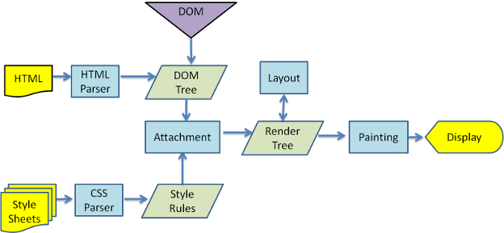

Есть некоторые веб-разработчики, которые не заботятся о структуре кода HTML или игнорируют количество переопределяемых правил CSS просто потому, что они не знают о некоторых понятиях, которые мы увидим ниже.

Понимание концепций и процессов, используемых браузером для рендеринга веб-страницы, действительно важно, когда мы работаем над проектами, где производительность и пользовательский опыт имеют решающее значение.

#### DOM (Document Object Model) и CSSOM (CSS Object Model)

Сервер доставляет фрагмент HTML-кода, который анализируется браузером, и создается дерево. Это дерево называется `DOM`. Кроме того, браузер также получает инструкции CSS, которые анализируются, и это генерирует другое дерево, называемое `CSSOM`.

#### Render Tree (Дерево рендера)

После завершения двух процессов синтаксического анализа и определения DOM и CSSOM браузер создает дерево рендера. Дерево рендера - это другое дерево, хранящееся внутри браузера и используемое для представления визуальных элементов. Элементы внутри `<head>` игнорируются, а также элементы, определенные с `display: none`. Однако стоит помнить, что элементы со свойством `visibility: hidden` по-прежнему являются частью дерева.

Как только рендер дерева завершен, браузер может выполнить процесс `reflow` (перекомпоновки) и `repaint`(перерисовки).

#### Reflow (перекомпоновка)

Процесс, используемый браузером для позиционирования элементов на экране, называется `Reflow`.

Этот процесс выполняется всегда, когда элементом DOM манипулируют, например, при изменении любого CSS правила положения или геометрии элемента, а также при изменении размера окна браузера. Процесс перекомпоновки выполняется для дочерних элементов, предков и элементов каждого элемента, которые появляются после него в DOM, после того, как ему необходимо пересчитать стили на основе целевого элемента.

#### Repaint (перерисовка)

Также известна как `redraw`. `Repaint` - это имя процесса, используемого браузером, когда ему нужно обновить какой-то стиль, который не относится к макету. Другими словами стили, не связанные с положением, шириной или высотой. Примером может служить манипулирование цветом фона.

#### В заключении

Подход к снижению нежелательных эффектов, вызванных перекомпоновками и перерисовками, заключается в уменьшении количества запросов, сделанных информацией о стилях, избегая добавления или удаления элементов, обновлений или анимаций в DOM, изменения размера окон, изменения размера шрифта и ненужной прокрутки страницы.

Таким образом, перед выполнением DOM-манипуляций убедитесь, что нет альтернативного способа решения этой проблемы.
