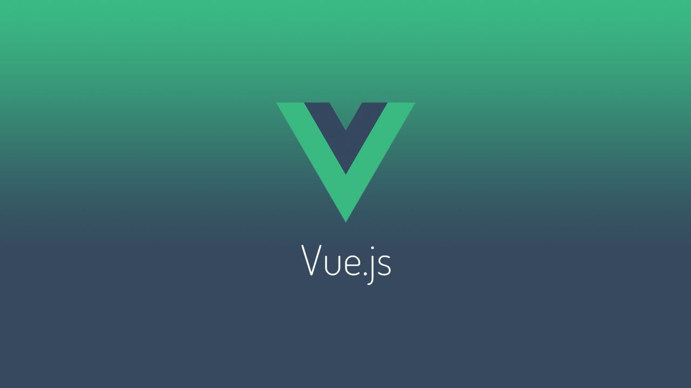
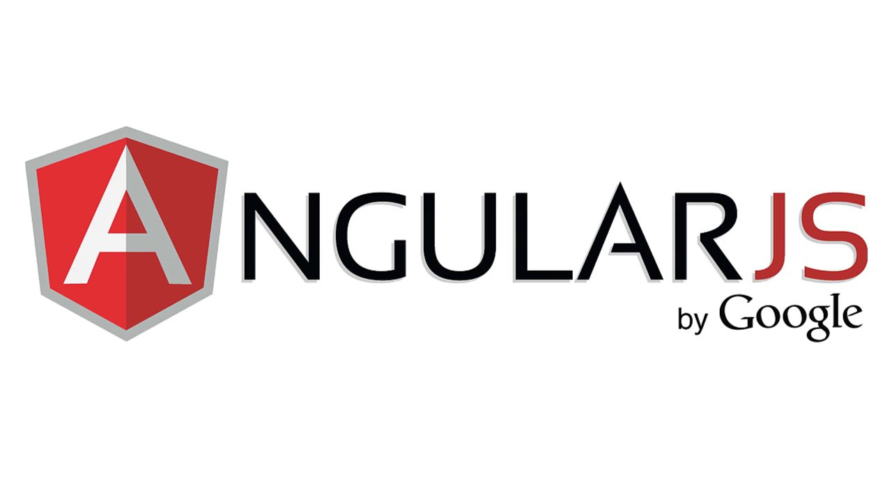
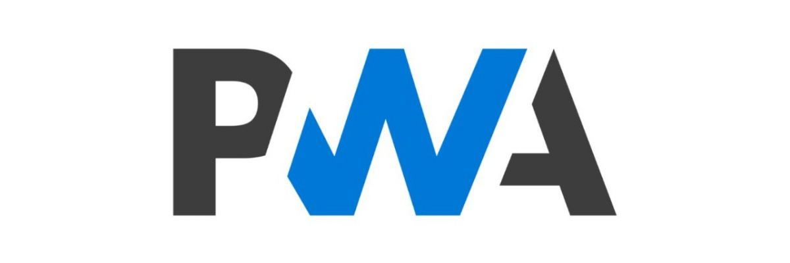

Согласно ежегодному опросу [Stack Overflow](https://insights.stackoverflow.com/survey/2020#technology-programming-scripting-and-markup-languages)
JavaScript держится уже восьмой год подряд в топе как самый используемый язык программирования. 

И как известно, JavaScript используется не только во frontend,
но и в мобильной, серверной и десктопной разработке.

Хотелось бы понять что нас ждёт в `2021 году` в плане развития JavaScript.

Ниже я составил рейтинг того, что будет развиваться в предстоящем году по моему мнению:

## [1. Vue](https://vuejs.org/)

Если сравнивать по пресловутым звёздочкам на `GitHub` основную тройку JavaScript фреймворков
для создания пользовательских интерфесов ([React](https://github.com/facebook/react), [Angular](https://github.com/angular/angular), [Vue](https://github.com/vuejs/vue)), 
то Vue занимает первое место. 

По моему мнению, фактически лидирует `React` на рынке, 
но это не мешает `Vue` расти и развиваться, а также завоёвывать сердца разработчиков. 

## [2. React](https://reactjs.org/)

`React` на текущий момент занимает лидирующую позицию на рынке JavaScript технологий. 
И в предстоящем году он будет только продолжать укреплять свою мощь.

Возможно, `Vue` заберёт какую-то часть рынка у `React`, но в ближашем будущем мы точно не увидем,
что React перестанет быть самым восстребованной технологией у [работодателей](https://spb.hh.ru/search/vacancy?clusters=true&area=2&enable_snippets=true&salary=&st=searchVacancy&text=react). 

## [3. Angular](https://angular.io/)

`Vue` подвинул данный фреймворк на третье место, но `Angular` до сих пор считается лучшим решением для enterprise проектов
и продолжает радовать тех, кому важно иметь всё необходимое для разработки приложения прямо из коробки.

## [4. Svelte](https://svelte.dev/)

В ноябре 2016 года был зарелижен это фреймворк для создания пользовательских интерфейсов.
Отличительной особенностью этого фреймворка от своих собратьев - это то, что он компилирует свой код в Vanilla JavaScript на этапе сборки ([AoT](https://ru.wikipedia.org/wiki/AOT-%D0%BA%D0%BE%D0%BC%D0%BF%D0%B8%D0%BB%D1%8F%D1%86%D0%B8%D1%8F))
и в связи с чем у нас полностью исчезают накладные расходы связанные с самим фреймворком.

На текущий момент я бы несколько раз подумал, прежде, чем тащить его в production,
хотя считаю его перспективным и достойным занять своё место на этом поприще.

## [5. Flutter](https://flutter.dev/)

Если же Вас интересует разработка кроссплатформенных приложений, то `Flutter` поможет Вам с этим.
`Flutter` позволяет писать код один раз, а запускать его на различных платформах - мобильные устройства, web и настольные компьютеры.
Когда-то [React Native](https://reactnative.dev/) хотел решить проблему разной кодовой базы для Android и iOS,
но на текущий момент мне он кажется больше мертвым, чем живым. 

В предстоящем году, я думаю, мы ещё не раз услышим о `Flutter`.

## [6. Next.js](https://nextjs.org/)

`Next.js `- это фреймворк для создания статических сайтов и приложений на `React` с серверным рендерингом. 
Он дает множество преимуществ, которые помогут создать и масштабировать Ваше приложение.
Из коробки он имеет такие вещи как `zero-configuration`, автоматический `code-splitting`, экспорт статики, настроенная под production сборка и т.д.

Также существует аналог на Vue - [Nuxt.js](https://nuxtjs.org/)

Данная технология подходит для решения определённого круга задач, 
но не смотря на это, имеет огромный потенциал.

## [7. Gatsby](https://www.gatsbyjs.com/)

Ещё один фреймворк, который позволяет вам сгенерировать статический сайт.
И также как и Next.js он основан на React.

Основным отличием от Next.js является то, что он генерит статические HTML страницы во время сборки и не требует запущенного nodeJS сервера.
В свою же очередь Next.js динамически генерирует HTML каждый раз, когда поступает новый запрос с использованием сервера.

## [8. Nest](https://nestjs.com/)

Еще один фреймворк с открытым исходным кодом, который использует TypeScript, о котором стоит упомянуть, - это `Nest.js`.
Основная цель `Nest.js` - создавать высоконадежные серверные приложения.

`NestJS` имеет следующие возможности:
- Имеет собственный [CLI](https://docs.nestjs.com/cli/overview), который позволит быстро начать новый проект, создавать новые модули и всё это собрать в единный бандл.
- Nest не зависит от [базы данных](https://docs.nestjs.com/techniques/database), что позволяет легко интегрироваться с любой базой данных SQL или NoSQL. 
Подключение Nest к базе данных - это просто вопрос загрузки соответствующего драйвера Node.js для базы данных, как в случае с Express или Fastify.
- Создавать [микросервисы](https://docs.nestjs.com/microservices/basics).
- Работа с [GraphQL](https://docs.nestjs.com/graphql/quick-start).
- Работа с [Websockets](https://docs.nestjs.com/websockets/gateways).
- и многое [другое](https://docs.nestjs.com/).

## [9. Jest](https://jestjs.io/)

`Jest` - это средство запуска тестов JavaScript, то есть библиотека JavaScript для создания, выполнения и структурирования тестов.

Он один из самых популярных средств запуска тестов в наши дни и выбор по умолчанию для проектов React.

Данный инструмент не ограничен одним React и его можно использовать вместе с любыи фреймворком,
чтобы и позволяет ему набирать больший охват аудитории.

## [10. PWA](https://web.dev/progressive-web-apps/)

`PWA (Progressive Web App)` - это приложение созданное при помощи общих веб-технологий, включая `HTML`, `CSS` и `JavaScript`.
Оно предназначено для работы на любой платформе, которая использует браузер, соответствующий стандартам, включая настольные и мобильные устройства.
Также данное приложение может работать оффлан и быть установлено на рабочий стол девайса.

На мой взгляд это самая недооценнённая технология, но с большим потенциалом. 
Пусть развитие и охват идут не семимильными шагами, но прогресс явно есть.

#### Заключение

Эта подборка - моё субъективное мнение о том, что будет на виду и слуху у разработчиков в 2021 году. 
Если же вы со мной не согласны, то можете оставить свои комментарии или дополнения ниже.
